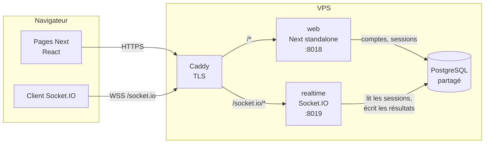

# ADR-001 — Un service temps réel séparé, Socket.IO, qui fait autorité

- **Statut :** accepté, 3 octobre 2026
- **Exigences :** TECH-4 (WebSockets), COURSE-1 à COURSE-4, COURSE-8, SALLE-10, SALLE-13 à SALLE-15
- **Hypothèses touchées :** H-13 (hébergement), H-9 (délais)

## Contexte

Typio est une course : chaque frappe d'un coureur doit apparaître en moins d'une
fraction de seconde sur les écrans des autres (COURSE-2), et la salle d'attente
reflète en direct la configuration de l'hôte (SALLE-10). Il faut donc un canal
persistant, serveur vers client, que HTTP seul ne donne pas.

Trois contraintes réelles pèsent sur le choix :

1. **L'hébergement est un VPS**, pas Vercel. Typio y tourne déjà : image construite par
   GitHub Actions, tirée depuis GHCR, derrière le Caddy existant, avec le PostgreSQL
   partagé de « carte » (voir [stack-docker-postgresql.md](../stack-docker-postgresql.md)).
   H-13 supposait Vercel + Render + Neon, justement parce que Vercel ne garde pas de
   WebSockets ouverts (C-16). Sur un VPS, cette raison disparaît.
2. **`output: standalone` est incompatible avec un serveur Next personnalisé.** La doc de
   Next 16 (`01-app/02-guides/custom-server.md`) le dit explicitement : le mode standalone
   produit son propre `server.js` minimal et ne trace pas les fichiers d'un serveur
   personnalisé. Or tout le Dockerfile repose sur standalone, pour tenir dans la mémoire
   du VPS.
3. **La mémoire.** Environ 350 Mo libres sur 1,9 Go, partagés avec huit conteneurs. Le
   conteneur `web` est plafonné à 512 Mo.

S'y ajoute une exigence de conception : **la progression est validée côté serveur**
(COURSE-8). Il faut un processus qui connaît le texte de la course et juge chaque frappe ;
le client ne peut pas être cru sur parole.

## Options étudiées

| | A. Serveur Next personnalisé | **B. Service temps réel séparé** | C. Service géré (Pusher, Ably) |
|---|---|---|---|
| Principe | Un seul processus Node/Bun sert les pages et les WebSockets | Next reste en standalone ; un second processus Socket.IO gère salles et courses | Next publie des événements vers un service tiers |
| Déploiement actuel | À réécrire : on perd standalone, l'image embarque tout `node_modules` | Conservé : même image, un second service compose | Conservé |
| Mémoire VPS | La plus faible | Un second processus, plafonné à 128 Mo | Rien |
| Serveur qui fait autorité (COURSE-8) | Oui | Oui | Non : il faudrait un serveur en plus, on retombe sur A ou B |
| Coût | 0 | 0 | Palier gratuit limité en connexions et en messages : une classe de 30 élèves qui tapent l'épuise vite |
| Couplage | Pages et logique de course dans le même processus : un plantage de la course coupe le site | Le site survit à un plantage de la course, et inversement | Dépendance à un tiers pour le cœur du produit |

## Décision

**Option B.** Un service `realtime`, écrit en TypeScript avec **Socket.IO**, tourne à côté de
Next et fait autorité sur tout ce qui vit pendant une salle et une course.

### Répartition des responsabilités

| `web` (Next) | `realtime` (Socket.IO) |
|---|---|
| Pages, i18n, thème | État des salles en mémoire : participants, configuration, hôte |
| Inscription, connexion, mode invité : crée la session et pose le cookie | Authentifie chaque connexion en lisant ce cookie et la table `sessions` |
| Statistiques, historique (lecture de `race_results`) | Machine à états de la salle et de la course ([machine-a-etats.md](machine-a-etats.md)) |
| | Génération du texte, compte à rebours, validation des frappes, classement |
| | Écrit la course et ses résultats en base à la fin |

### Choix détaillés

- **Socket.IO plutôt que `ws` brut.** Il apporte les salles (`io.to(code)`), les accusés de
  réception, la reconnexion automatique côté client et le repli en long polling quand un
  réseau scolaire bloque les WebSockets. C'est exactement ce dont ont besoin SALLE-13 et
  COURSE-4. Le prix, un client de l'ordre de 15 Ko compressés (à mesurer au premier build), est
  acceptable.
- **Même origine.** Caddy route `/socket.io/*` vers `realtime` et le reste vers `web`. Le
  navigateur envoie donc le cookie de session au service temps réel sans configuration
  CORS en production, et le HTTPS (TECH-5) couvre les deux d'un coup.
- **Même image, deux services.** Le service est compilé en un seul fichier par
  `bun build --target=bun`, copié dans l'image `runner` comme `scripts/migrate.ts`, et lancé
  par un second service compose (`command: ["bun", "realtime.js"]`, `mem_limit: 128m`,
  port `127.0.0.1:8019`). Il n'y a ni deuxième image, ni deuxième pipeline CI.
- **L'état vivant reste en mémoire, pas en base.** Une salle d'attente change plusieurs fois
  par seconde et ne vaut rien une fois fermée. Seuls la course terminée et ses résultats
  sont écrits en base (voir [modele-de-donnees.md](modele-de-donnees.md)).
- **Le serveur juge les frappes.** Le client envoie ses frappes par paquets
  (`race:input`) ; le serveur les rejoue contre le texte, calcule position, MPM et
  précision, et rejette une cadence humainement impossible (COURSE-8). Le client
  n'affiche que ce que le serveur lui renvoie.
- **Diffusion.** En salle d'attente, le serveur diffuse l'état complet de la salle à chaque
  changement (petit, idempotent, simple à rattraper après une reconnexion). En course,
  il diffuse le classement au plus toutes les 100 ms.

### Protocole (périmètre du checkpoint 1)

| Sens | Événement | Contenu |
|---|---|---|
| client → serveur | `room:create` | configuration initiale ; refusé à un invité (SALLE-12) |
| client → serveur | `room:join` | `code`, rôle `runner` ou `spectator` (SALLE-7) |
| client → serveur | `room:updateConfig` | hôte seulement |
| client → serveur | `room:leave` | — |
| serveur → client | `room:state` | état complet de la salle |
| serveur → client | `room:error` | code d'erreur traduisible côté client (`ROOM_NOT_FOUND`, `NOT_HOST`, `GUEST_CANNOT_CREATE`…) |

Les événements de course (`race:start`, `race:countdown`, `race:input`, `race:progress`,
`race:finished`) suivent la même convention ; ils seront détaillés avec la fonctionnalité.

## Conséquences

**Positives**

- La chaîne de déploiement existante ne change que par l'ajout d'un service compose et
  d'une route Caddy.
- La logique de course est un module TypeScript pur, testable sans navigateur ni réseau :
  la machine à états prend un état et un événement et rend un nouvel état.
- Un plantage du service temps réel n'emporte pas le site, et inversement.

**Négatives, assumées**

- **Un seul processus `realtime`.** Il héberge toutes les salles et toutes les courses
  simultanées, chacune isolée dans sa salle Socket.IO : dix classes peuvent courir en même
  temps. Ce qu'il ne permet pas, c'est de répartir la charge sur plusieurs processus, car
  leur mémoire n'est pas partagée : il faudrait alors un adaptateur Redis. Pour un
  établissement, un processus suffit ; sa capacité réelle sera mesurée par un test de
  charge avec la fonctionnalité « salle ».
- **Un redémarrage perd les salles ouvertes.** Un déploiement pendant une course la
  coupe. Il faut déployer hors des heures d'usage ; les courses déjà terminées sont en base.
- **Deux processus en développement.** `bun run dev` lance Next, et un second script lance
  `realtime`. En local, le client vise `NEXT_PUBLIC_REALTIME_URL` (par défaut la même
  origine) ; les cookies passent, car ils ignorent le port.
- **Socket.IO sous Bun est à vérifier.** Socket.IO cible Node ; Bun implémente `node:http`.
  La première tâche de la fonctionnalité « salle » est un essai minimal : connexion,
  salle, reconnexion, sous `bun`, dans l'image. En cas d'échec, l'image runner reçoit Node
  pour ce seul service, sans changer le reste de la décision.

## Suites

- Réviser H-13 dans le cahier des charges, avec un renvoi vers cet ADR.
- Ajouter le service `realtime` à `docker-compose.yml`, à `infra/docker-compose.yml` et la
  route `/socket.io/*` à `infra/caddy/typio.caddyfile`.
