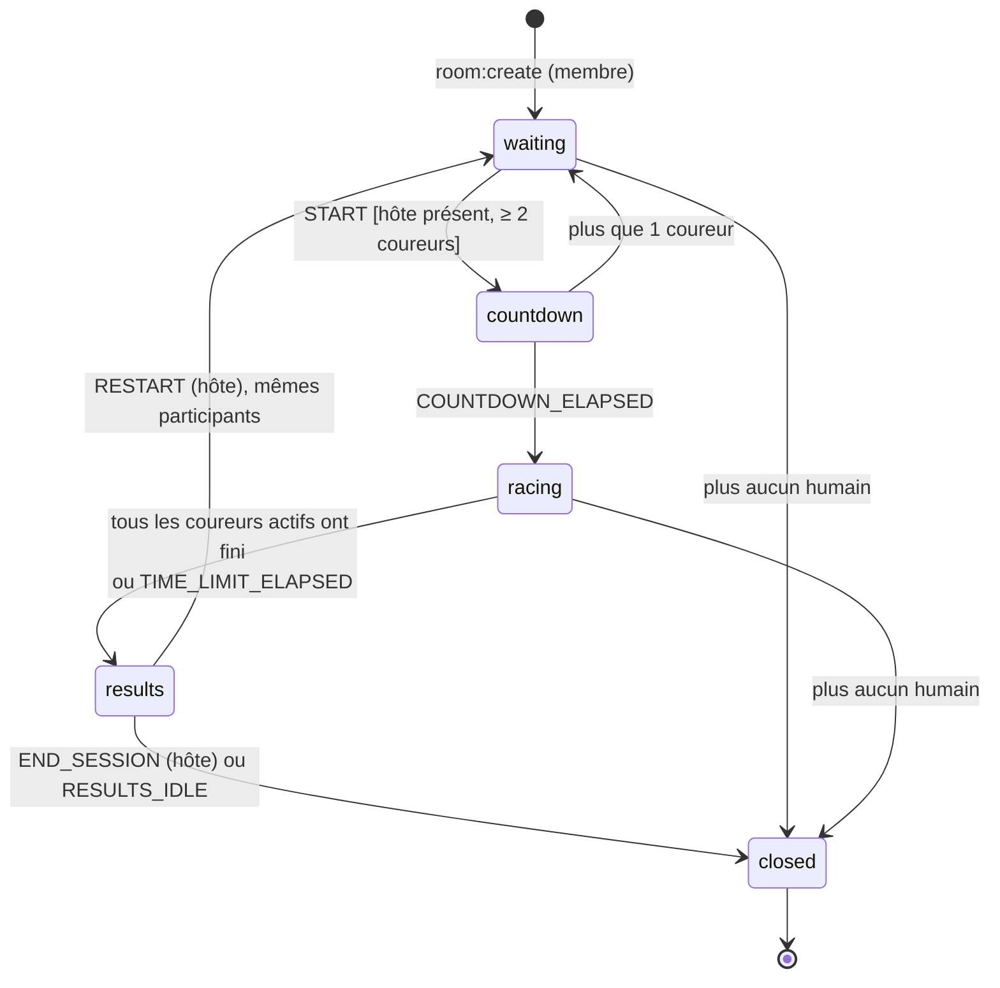
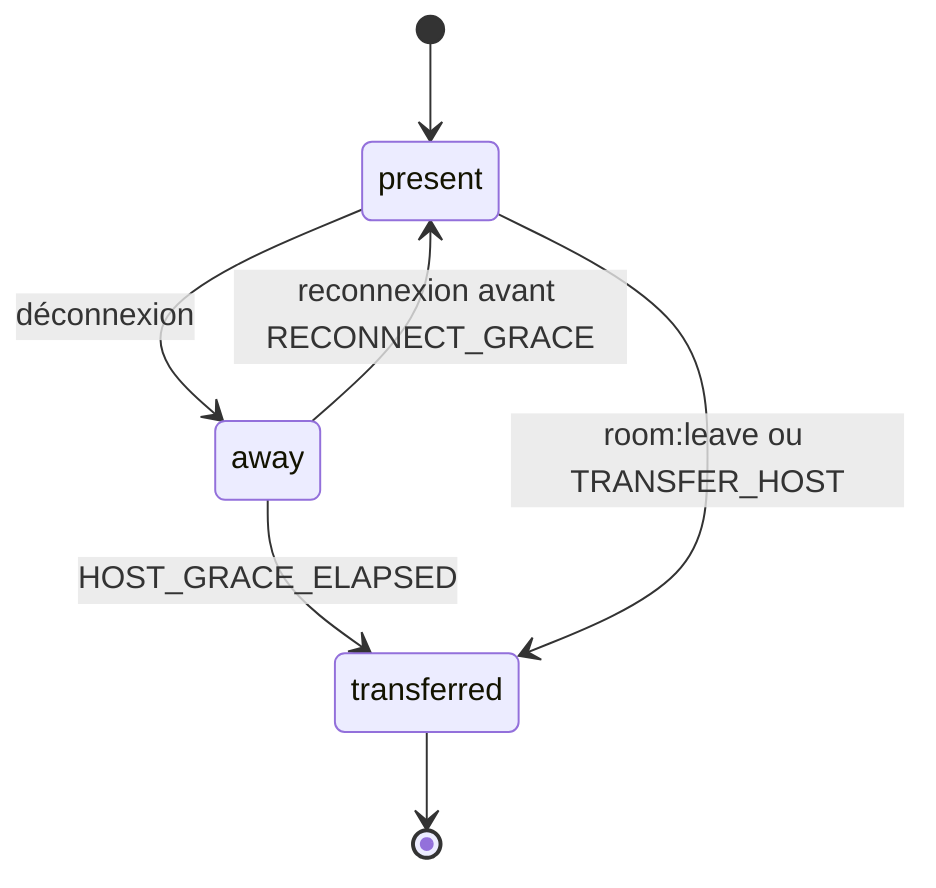
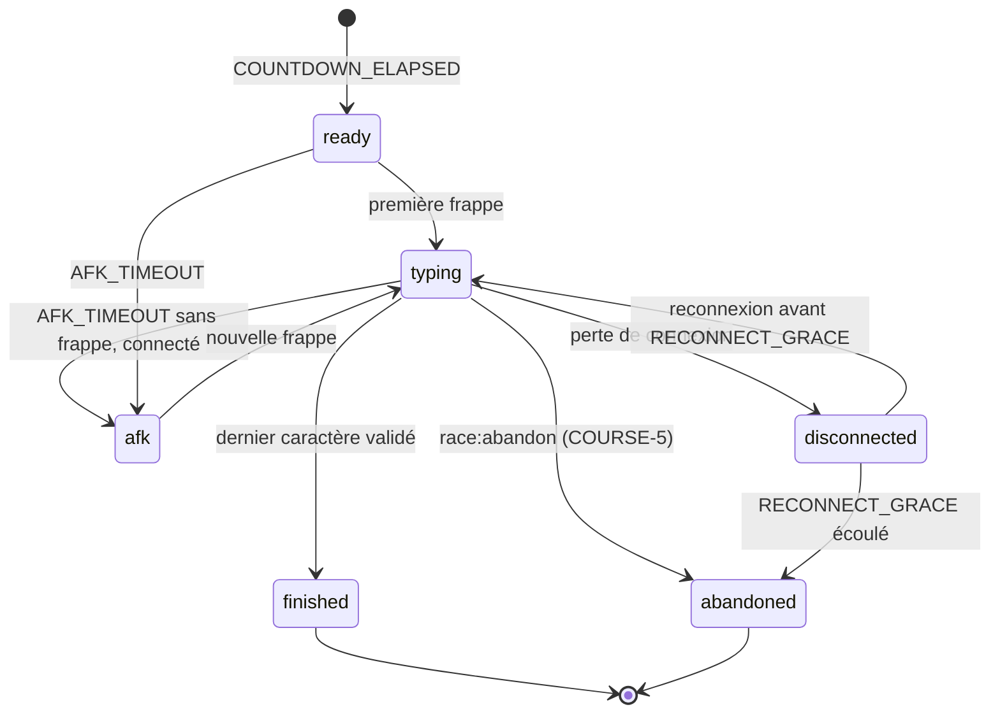

# Machine à états — salle, course et coureur

- **Exigences :** SALLE-7, SALLE-8, SALLE-10, SALLE-13 à SALLE-15, COURSE-1 à COURSE-6, RES-4
- **Hypothèses :** H-3 (un bot compte comme coureur), H-9 (délais), H-16 (20 coureurs)
- **Où elle vit :** dans le service `realtime`, qui fait autorité ([ADR-001](adr-001-temps-reel.md))

La machine est écrite comme une **fonction pure** : `(état, événement, maintenant) → nouvel
état + effets à exécuter` (diffuser, armer un minuteur, écrire en base). Les minuteurs
sont des événements comme les autres (`COUNTDOWN_ELAPSED`, `HOST_GRACE_ELAPSED`…).
Les tests rejouent donc n'importe quel scénario sans horloge réelle ni réseau.

## Délais (H-9)

| Nom | Valeur | Rôle |
|---|---|---|
| `COUNTDOWN` | 3 s | Compte à rebours avant le départ (COURSE-1) |
| `RECONNECT_GRACE` | 60 s | Un hôte ou un coureur déconnecté garde sa place (SALLE-13, COURSE-4) |
| `AFK_TIMEOUT` | 30 s | Coureur connecté qui ne tape plus (COURSE-6) |
| `DEFAULT_TIME_LIMIT` | 5 min | Limite par défaut si l'hôte n'en fixe pas (CONFIG-6, C-12) |
| `RESULTS_IDLE` | 10 min | Une salle de résultats sans action est fermée |

## 1. La salle

| État | Ce qui est permis |
|---|---|
| `waiting` | Rejoindre comme coureur ou spectateur ; l'hôte change la config (diffusée à tous, SALLE-10), retire un participant, ajoute des bots, transfère son rôle |
| `countdown` | Config verrouillée. Un nouvel arrivant entre comme spectateur. |
| `racing` | Frappes, abandon. Un nouvel arrivant entre comme spectateur. |
| `results` | Consulter le podium ; l'hôte relance ou termine (RES-4) |
| `closed` | Plus rien : la salle est retirée de la mémoire, son code est libéré |

**Garde de `START`** : l'émetteur est l'hôte, l'hôte est connecté (SALLE-13 : personne
d'autre ne lance pendant son absence), et la salle compte au moins 2 coureurs, bots
inclus (SALLE-8, H-3). C-4 est résolu ainsi : un élève seul plus un bot fait 2 coureurs.

**Plafond** : 20 coureurs (H-16). Au-delà, `room:join` comme coureur est refusé et la
personne peut entrer en spectatrice.

## 2. Le rôle d'hôte

L'hôte n'est pas un état de la salle : c'est un attribut (`hostId`) avec sa propre petite
machine, valable dans tous les états sauf `closed`.

- **Transfert désigné** (SALLE-14) : l'hôte nomme un participant humain, qui devient
  hôte immédiatement.
- **Transfert automatique** (SALLE-15) : l'hôte part sans désigner personne, ou ne revient
  pas avant `RECONNECT_GRACE`. Le rôle passe au **participant humain connecté le plus
  ancien**, coureur ou spectateur, invités compris. Un bot ne devient jamais hôte.
- S'il ne reste aucun humain, la salle passe à `closed`.

> Un invité ne peut pas *créer* une salle (SALLE-12) mais peut en *hériter*. Le cahier ne
> l'interdit pas, et fermer la salle d'une classe parce que le plus ancien est un invité
> serait pire. **À confirmer** avec le client.

## 3. Le coureur pendant une course

**Coureurs actifs** : `ready`, `typing` et `disconnected`. La course se termine quand il
n'en reste aucun, ou à la limite de temps (COURSE-3).

**C-9 et C-12 résolus** :

- Un coureur déconnecté n'est **pas** AFK. Son minuteur AFK est suspendu ; seul
  `RECONNECT_GRACE` court. À son retour, il reprend à sa position (COURSE-4), puisque le
  serveur la connaît.
- Un coureur `afk` sort du classement actif (COURSE-6) mais peut y revenir en tapant.
  Il ne bloque pas la fin de course : sans limite de temps, la course se termine quand
  tous les autres ont fini.
- La limite de temps par défaut (5 min) garantit qu'une course ne reste jamais bloquée.

## 4. Classement

Le classement se base sur le **pourcentage du texte complété** (H-8), puis, à égalité, sur
l'heure d'arrivée. Pour les coureurs `finished`, le rang est l'ordre d'arrivée.

MPM et précision sont calculés par le serveur à partir des frappes rejouées, jamais reçus
du client :

- **MPM** = (caractères corrects / 5) / minutes écoulées depuis le départ (glossaire : 1 mot = 5 caractères).
- **Précision** = positions du texte réussies au premier essai / positions atteintes
  (glossaire : « du premier coup »). Une faute corrigée ensuite reste une faute.

Les arrondis (affichage à l'entier pour les MPM, à 0,1 % pour la précision) sont proposés
et seront confirmés avec la fonctionnalité de course.

## Transitions refusées

Tout événement non prévu dans l'état courant est ignoré et renvoie `room:error` à
l'émetteur seulement, sans changer l'état. Exemples : `START` émis par un non-hôte
(`NOT_HOST`), `room:updateConfig` pendant `racing` (`CONFIG_LOCKED`), `room:create` par
un invité (`GUEST_CANNOT_CREATE`). Chacun de ces refus est un cas de test.
