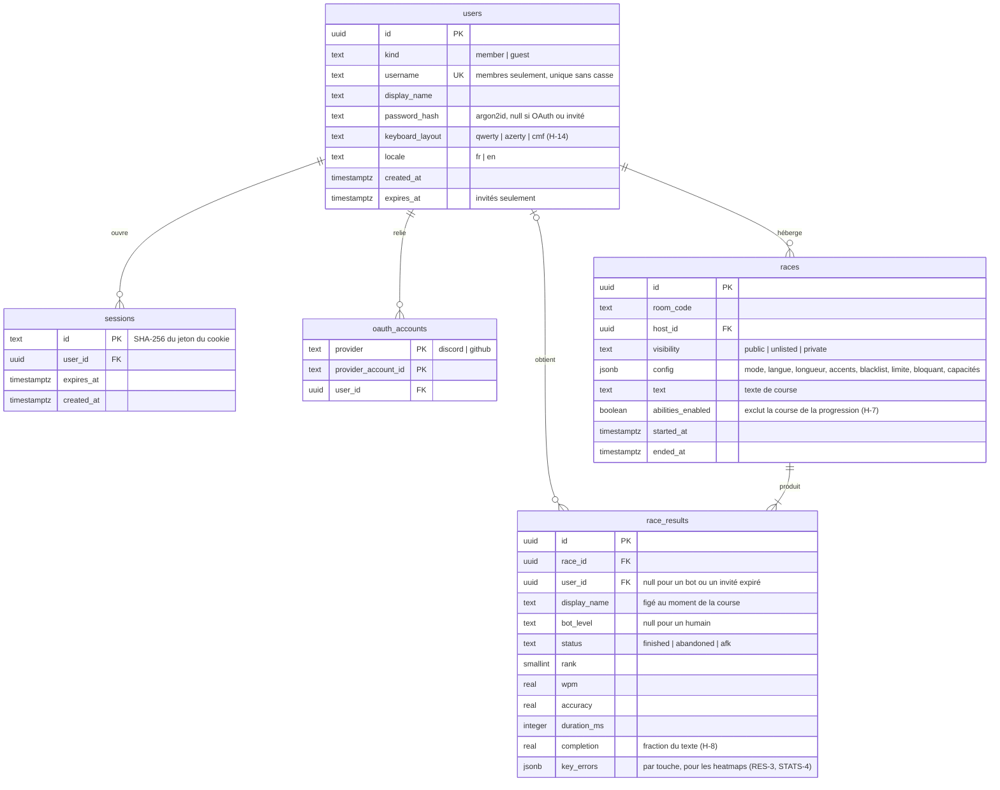

# Modèle de données

- **Base :** PostgreSQL (TECH-3), base `typio` sur le serveur partagé du VPS, schéma géré par
  Drizzle (`src/db/schema.ts`, migrations dans `drizzle/`)
- **Principe :** la base garde ce qui doit **durer** (comptes, sessions, courses terminées et
  leurs résultats). Ce qui vit le temps d'une salle (participants, configuration en cours,
  positions, énergie) reste en mémoire dans le service `realtime` ([ADR-001](adr-001-temps-reel.md)).

## Schéma

## Choix et justifications

**Un seul type `users` pour les membres et les invités.** Un invité (AUTH-4) a lui aussi
une session et peut finir sur un podium. Lui donner une ligne `users` avec
`kind = 'guest'` évite de dédoubler toute la logique de session et de classement.
`expires_at` borne sa durée de vie (H-2 : ses statistiques n'existent que le temps de sa
session). Un invité est supprimé **dès qu'il se déconnecte**. Sinon, un nettoyage le
supprime après expiration : il tourne par lots de 500, au plus une fois par minute, à la
moindre visite (`src/auth/purge.ts`). Quand `race_results` existera, ses résultats
resteront, avec `user_id = null` et le `display_name` figé, pour que le podium des autres ne
perde pas de ligne. Un pseudo d'invité identique, sans tenir compte de la casse, à
l'identifiant d'un membre est refusé, pour qu'un invité ne puisse pas se faire passer pour
un membre.

**Pas de rôle enseignant.** C-1 est résolu : tout membre peut être hôte. Aucune colonne
`role`.

**Sessions maison, jetons hachés.** Le cookie contient un jeton aléatoire de 32 octets ; la
base ne stocke que son SHA-256. Une fuite de la table ne permet donc pas d'usurper une
session. En production, le cookie s'appelle `__Host-typio_session` (`HttpOnly`, `Secure`,
`SameSite=Lax`, sans `Domain`) : un sous-domaine voisin ne peut pas l'écraser. La session dure
30 jours avec « Rester connecté », sinon 24 h au plus, sans prolongation automatique. Une
nouvelle connexion révoque la session précédente du navigateur. Le service `realtime` lit cette même table pour authentifier chaque connexion
WebSocket : c'est le seul point de contact entre les deux services, en plus des
résultats.

**`password_hash` en argon2id** (AUTH-5 ; m = 19 Mio, t = 2, p = 1, d'après l'OWASP), nul
pour les invités. La contrainte actuelle l'exige pour tout membre : les comptes OAuth
demanderont une migration qui l'assouplit. Des CHECK bornent `username` à 20 caractères et
`display_name` à 40, en défense en profondeur derrière la validation de l'application.
`username` est unique sans tenir compte de la casse, grâce à un index sur `lower(username)` :
`Patrick` et `patrick` sont le même compte. On évite l'extension `citext`, qu'on ne peut
pas supposer installable sur la base partagée.

**`oauth_accounts` à part** (AUTH-2, AUTH-3, souhaitables). Un membre peut relier Discord
et GitHub au même compte. La clé `(provider, provider_account_id)` empêche qu'un même
compte Discord ouvre deux comptes Typio.

**Les salles ne sont pas une table.** Une salle d'attente change plusieurs fois par seconde
et ne vaut rien une fois fermée. Son code (H-5) n'a besoin d'être unique que parmi les
salles ouvertes, ce que le service `realtime` garantit en mémoire. Les liens d'invitation
à usage unique (SALLE-5, H-4) expirent au départ de la course : ils vivent avec la salle.
`races` n'est écrite qu'au départ d'une course, et complétée à sa fin.

**`config` en `jsonb`.** La configuration (CONFIG-1 à 9) évolue avec les fonctionnalités et
n'est jamais filtrée en SQL, sauf `abilities_enabled`, sortie en colonne parce que le
graphique de progression doit exclure ces courses (H-7, C-7).

**Rien pour les personnages.** H-18 débloque les personnages selon le nombre de courses
terminées : c'est un `count(*)` sur `race_results`, pas une table à tenir à jour.

**Les heatmaps dans `key_errors`.** Un objet `{ "e": 3, "é": 5 }` par résultat suffit à
la heatmap d'une course (RES-3) et se cumule pour la heatmap personnelle (STATS-4). La
disposition du clavier (H-14, C-15) est sur l'utilisateur, car une même erreur de touche
ne se dessine pas au même endroit en AZERTY et en QWERTY.

## Index

| Index | Pour |
|---|---|
| `users (lower(username))` unique | Connexion par identifiant |
| `sessions (user_id)` | Déconnexion de toutes les sessions |
| `sessions (expires_at)` | Nettoyage |
| `users (expires_at) where kind = 'guest'` | Nettoyage des invités |
| `race_results (user_id, race_id)` | Historique et progression (STATS-1 à 3) |

## Périmètre du checkpoint 1

Seules `users` (membres et invités) et `sessions` sont nécessaires pour le checkpoint :
connexion par identifiants, mode invité, salle rejointe par code. `races`, `race_results`
et `oauth_accounts` sont décrites ici pour valider le modèle, et seront créées avec leurs
fonctionnalités.
