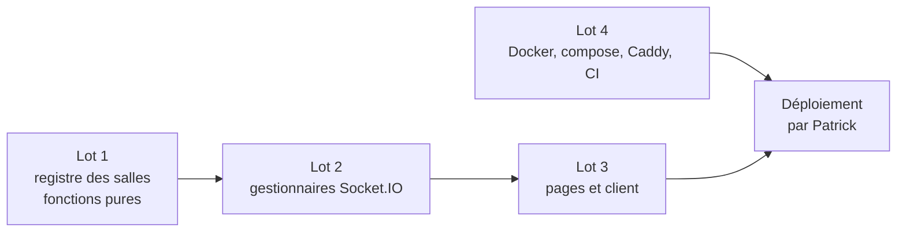

# Plan — salle créée et rejointe par code, en temps réel (checkpoint 1)

- **Exigences :** SALLE-1, SALLE-4 (code, sans QR), SALLE-7, SALLE-10, SALLE-12, SALLE-13 et SALLE-15 (version simple), H-5, H-9, H-16
- **Décisions déjà prises :** [ADR-001](architecture/adr-001-temps-reel.md) (service Socket.IO séparé), [machine à états](architecture/machine-a-etats.md) § 1 et § 2
- **Branche de base :** `feat/realtime-room-protocol` (le protocole y est installé)
- **But :** montrer au checkpoint qu'un membre crée une salle, qu'un autre client la rejoint par code, et que la liste des participants et la configuration changent chez tous **sans recharger**.

> **Délégation temporaire.** Les lots 1 à 4 sont confiés à Codex et Antigravity. Ils seront
> audités, et repris si nécessaire, par la chaîne Claude (`qa`, `code-reviewer`,
> `security-reviewer`). Le niveau visé est « démontrable et propre », pas « définitif ».

## Ce qui est déjà en place (ne pas réécrire)

| Fichier | Rôle |
|---|---|
| `src/realtime/protocol.ts` | **Le contrat.** Événements typés, `RoomState`, `RoomConfig`, codes d'erreur, `parseRoomConfigPatch`, `parseJoinPayload`. Les deux côtés l'importent. |
| `src/realtime/roomCode.ts` | Code de salle H-5 : 6 caractères, alphabet sans 0/O/1/I/L, tirage cryptographique, `generateUniqueRoomCode`. |
| `src/realtime/auth.ts` | Lit le cookie de session de la poignée de main et le valide contre `sessions` ; vérifie l'`Origin`. |
| `src/realtime/server.ts` | Serveur HTTP + Socket.IO, middleware d'authentification, `/healthz`. Appelle `registerRoomHandlers`. |
| `src/realtime/roomHandlers.ts` | **Bouchon** à remplacer (lot 2). |
| `src/realtime/main.ts` | Point d'entrée : lit `REALTIME_PORT` (3001), `APP_ORIGIN`, `DATABASE_URL`. |
| `src/realtime/testSupport.ts` | `startTestServer()`, `createFakeSessions().signIn("member" \| "guest")`, `waitForConnection()`. |
| `src/auth/drizzleSessionRepository.ts` | Dépôt de sessions sans `server-only`, importable hors de Next. |
| `package.json` | `bun run dev:realtime` (watch), `bun run build:realtime` → `dist/realtime.js` (autonome, ~0,7 Mo). |

Vérifié : Socket.IO tourne sous Bun, en bundle unique, sans `node_modules` à côté ; le
transport WebSocket passe, une connexion sans cookie reçoit `UNAUTHENTICATED`, une origine
étrangère est refusée.

### Le protocole en une table

| Sens | Événement | Charge utile | Réponse (accusé) |
|---|---|---|---|
| C → S | `room:create` | `Partial<RoomConfig>` ou rien | `{ ok: true, data: { code } }` ou `{ ok: false, error }` |
| C → S | `room:join` | `{ code, role: "runner" \| "spectator" }` | idem |
| C → S | `room:updateConfig` | `Partial<RoomConfig>` | `{ ok: true }` ou `{ ok: false, error }` |
| C → S | `room:leave` | — | idem |
| S → C | `room:state` | `RoomState` complet, à **toute** la salle, après chaque changement | — |
| S → C | `room:error` | `RoomErrorCode`, erreur non sollicitée | — |

Un refus ne change jamais l'état et ne part qu'à l'émetteur (dans l'accusé). Les erreurs
sont des **codes**, traduits côté client (UI-5).

## Découpage



Les lots 1 et 4 sont indépendants et peuvent partir en parallèle. Le lot 3 peut commencer
sa partie visuelle en parallèle du lot 2, contre le contrat de `protocol.ts`.

**Proposition de répartition :** Codex sur les lots 1 et 2 (logique et serveur, testés),
puis 4 ; Antigravity sur le lot 3 (pages, navigateur, captures).

---

## Lot 1 — Registre des salles (logique pure)

**Fichiers :** créer `src/realtime/roomStore.ts` et `src/realtime/roomStore.test.ts`.
**Ne pas toucher :** `protocol.ts`, `auth.ts`, `server.ts`.

Un registre en mémoire (`Map<code, Room>`) et des fonctions **sans Socket.IO, sans
minuteur, sans horloge réelle** : chaque fonction reçoit `now: number` et rend soit
`{ ok: true, state: RoomState }`, soit `{ ok: false, error: RoomErrorCode }`. Elle ne
modifie rien en cas de refus.

API suggérée (libre si l'esprit est respecté) :

```ts
createRoomStore(): {
  create(user, configPatch, now)            // → { ok, state } | { ok:false, error }
  join(user, code, role, now)
  updateConfig(userId, code, patch)
  leave(userId, code)                        // départ volontaire
  disconnect(userId, code)                   // passe connected:false
  reconnect(userId, code)                    // repasse connected:true
  expire(userId, code)                       // fin du délai de grâce : retire le participant
  get(code): RoomState | null
  roomOf(userId): string | null
}
```

Critères d'acceptation :

- **AC-1 (SALLE-1)** Un membre crée une salle : code valide (`isRoomCode`), statut `waiting`, il est hôte et unique participant, rôle `runner`, config = `DEFAULT_ROOM_CONFIG` + patch.
- **AC-2 (SALLE-12)** Un invité qui crée reçoit `GUEST_CANNOT_CREATE`.
- **AC-3 (SALLE-4, SALLE-7)** Un autre utilisateur (membre ou invité) rejoint par code comme `runner` ou `spectator` ; il est ajouté en fin de liste avec `joinedAt = now`.
- **AC-4** Code inconnu → `ROOM_NOT_FOUND`.
- **AC-5 (H-16)** Le 21ᵉ coureur → `ROOM_FULL` ; il peut encore entrer comme `spectator`.
- **AC-6** Un utilisateur déjà dans une salle qui en crée ou rejoint une **autre** → `ALREADY_IN_ROOM`. Rejoindre **la même** salle est idempotent (rend l'état, utile au rechargement de page et au multi-onglet) et le repasse `connected: true`.
- **AC-7 (SALLE-10)** L'hôte change la config : seules les clés du patch changent. Un non-hôte → `NOT_HOST`. Utilisateur absent de la salle → `NOT_IN_ROOM`.
- **AC-8 (SALLE-15)** L'hôte part (`leave` ou `expire`) : le rôle passe au participant **connecté** le plus ancien (`joinedAt`), invités compris. Le dernier humain qui part supprime la salle et libère son code.
- **AC-9 (SALLE-13)** `disconnect` ne retire personne et ne transfère pas le rôle d'hôte : seul `expire` le fait.
- **AC-10** Le code d'une nouvelle salle n'est jamais celui d'une salle ouverte (`generateUniqueRoomCode` avec `isTaken`).
- **AC-11** Les états rendus sont des copies : modifier un `RoomState` reçu ne change pas le registre.

Tests unitaires Vitest pour chaque AC, sans réseau.

---

## Lot 2 — Gestionnaires Socket.IO

**Fichiers :** remplacer `src/realtime/roomHandlers.ts` ; créer `src/realtime/roomHandlers.test.ts`.
Brancher le registre dans `server.ts` (le créer une fois par serveur et le passer dans `deps`).
**Ne pas toucher :** `protocol.ts` (si un manque apparaît, le signaler au lieu de le contourner), `auth.ts`.

Règles :

- Chaque gestionnaire **valide** sa charge utile (`parseRoomConfigPatch`, `parseJoinPayload`), puis appelle le registre, puis diffuse. Aucune règle métier ici.
- L'identité vient **uniquement** de `socket.data.user`, jamais de la charge utile.
- Si `ack` n'est pas une fonction (client modifié), ignorer l'événement sans planter.
- Après succès : `socket.join(code)`, `socket.data.roomCode = code`, puis `io.to(code).emit("room:state", state)`.
- `room:leave` : `socket.leave(code)`, `roomCode = null`, diffusion aux restants.
- **Déconnexion** (`disconnect`) : si l'utilisateur n'a plus **aucun** socket dans la salle (multi-onglet : vérifier avec `io.in(code).fetchSockets()`), appeler `store.disconnect`, diffuser, armer un minuteur de `RECONNECT_GRACE_MS` qui appelle `store.expire` et diffuse. Un `room:join` de la même salle avant l'échéance annule le minuteur.
- Toute exception → accusé `{ ok: false, error: "INTERNAL" }`, journal serveur sans cookie ni jeton.

Critères d'acceptation (tests d'intégration avec `startTestServer()` et deux à trois clients) :

- **AC-1** Membre A crée → reçoit le code dans l'accusé **et** un `room:state`.
- **AC-2** Invité B rejoint par ce code → A et B reçoivent tous deux un `room:state` à 2 participants.
- **AC-3 (SALLE-10)** A change la langue → B reçoit le `room:state` mis à jour sans rien demander.
- **AC-4** B tente `room:updateConfig` → accusé `NOT_HOST`, aucune diffusion.
- **AC-5** B tente `room:create` → `GUEST_CANNOT_CREATE`.
- **AC-6** Charge utile invalide (`{ hostId: "x" }`, code `"abc"`) → `INVALID_PAYLOAD` / `INVALID_CODE`.
- **AC-7** A quitte → B reçoit un état où il est hôte.
- **AC-8** B se déconnecte → A voit `connected: false` ; B se reconnecte et rejoint dans le délai → `connected: true`, même `joinedAt`. Minuteur testé avec `vi.useFakeTimers()` ou un délai injecté.

---

## Lot 3 — Pages et client

**Lire d'abord** `AGENTS.md` (Next 16 diffère de ce que tu connais : lire `node_modules/next/dist/docs/`) et la section « UI provisoire » de `CLAUDE.md`.

**Fichiers :**

- `src/realtime/client.ts` : client Socket.IO unique pour l'onglet (`"use client"`), `withCredentials: true`, URL = `process.env.NEXT_PUBLIC_REALTIME_URL` ou, absente, la même origine. Ajouter `NEXT_PUBLIC_REALTIME_URL=http://localhost:3001` à `.env.example` (développement : Next sur 3000, realtime sur 3001).
- `src/realtime/useRoom.ts` : hook qui expose `state`, `error`, `create`, `join`, `updateConfig`, `leave` (promesses sur les accusés).
- `src/app/[lang]/(site)/play/page.tsx` : deux blocs, « Créer une salle » (membres) et « Rejoindre avec un code » (champ de 6 caractères, choix coureur/spectateur). Un invité voit la création désactivée avec une phrase qui explique pourquoi (SALLE-12). Pas de session → redirection vers la connexion (voir `getCurrentUser` dans `src/auth/currentUser.ts`).
- `src/app/[lang]/(site)/room/[code]/page.tsx` : salle d'attente. Le code en grand (copiable), la liste des participants (nom, coureur/spectateur, badge hôte, état déconnecté), la configuration : **éditable** (selects) pour l'hôte, **en lecture** pour les autres, mise à jour en direct. Bouton « Quitter ». Au chargement, émettre `room:join` avec le code de l'URL (idempotent, AC-6 du lot 1).
- Activer les boutons « Créer une course » et « Rejoindre avec un code » de `src/components/home/HomeHero.tsx` et `HomeCallToAction.tsx` vers `/[lang]/play`.
- Dictionnaires `src/i18n/dictionaries/fr.json` **et** `en.json`, ensemble : une section `room` avec libellés, valeurs de config et `room.errors.<CODE>` pour **chaque** code de `ROOM_ERROR_CODES`.

**Ne pas toucher :** `src/realtime/protocol.ts`, `auth.ts`, `server.ts`, les fichiers d'auth.

Critères d'acceptation :

- **AC-1** Avec deux navigateurs (un membre, un invité en fenêtre privée), le membre crée, l'invité entre le code : les deux voient la liste à 2 sans recharger.
- **AC-2 (SALLE-10)** L'hôte change langue / mode / longueur / limite : l'autre écran se met à jour en moins d'une seconde.
- **AC-3** Chaque refus affiche un message traduit, jamais un code brut.
- **AC-4 (UI-3, UI-4, UI-5)** Pages vérifiées en clair et sombre, mobile et ordinateur, FR et EN. Aucun texte en dur. Composants de `src/components/` (`Button`, `TextField`, `Card`, `Badge`).
- **AC-5** Accessibilité : champs étiquetés, la liste des participants annoncée (`aria-live="polite"`), navigation au clavier.
- **AC-6** Tests Vitest des composants clés (formulaire de code : normalisation et validation ; vue hôte vs vue participant), avec un faux `useRoom`.

---

## Lot 4 — Docker, compose, Caddy, CI

**Lire d'abord** `AGENTS.md` (section infrastructure) et [stack-docker-postgresql.md](stack-docker-postgresql.md).
Trois règles non négociables : **jamais de `build:` dans `infra/docker-compose.yml`** ; **même image** pour `web` et `realtime` ; ports publiés **sur `127.0.0.1` seulement**.

- **`Dockerfile`**, étape `builder` : ajouter `RUN bun run build:realtime` après `bun run build`. Étape `runner` : `COPY --from=builder --chown=typio:typio /app/dist/realtime.js ./realtime.js`. Rien d'autre à copier, le bundle est autonome.
- **`docker-compose.yml`** (local) : service `realtime`, même `build`, `command: ["bun", "realtime.js"]`, `REALTIME_PORT=3001`, `HOSTNAME=0.0.0.0`, `APP_ORIGIN=http://localhost:3000`, `DATABASE_URL` comme `web`, `ports: ["3001:3001"]`, dépend de `migrate`.
- **`infra/docker-compose.yml`** : service `realtime` avec la **même** `image` et `pull_policy: always` que `web`, `command: ["bun", "realtime.js"]`, `environment` : `DATABASE_URL`, `APP_ORIGIN`, `REALTIME_PORT: 3001`, `HOSTNAME: 0.0.0.0` ; `ports: ["127.0.0.1:8019:3001"]` ; `mem_limit: 128m`, `memswap_limit: 128m` ; healthcheck `wget -q -O /dev/null http://127.0.0.1:3001/healthz` ; mêmes `networks` et `logging` que `web`. Commenter chaque choix dans le style du fichier.
- **`infra/caddy/typio.caddyfile`** : avant le `reverse_proxy` existant, `reverse_proxy /socket.io/* 127.0.0.1:8019` (Caddy gère l'upgrade WebSocket seul). Garder les marqueurs `>>> Typio — début` / `<<< Typio — fin`.
- **`infra/deployer.sh`** : vérifier qu'il relance les deux services ; sinon l'adapter.
- **`.github/workflows/ci.yml`**, job `quality` : ajouter `bun run build:realtime` après le build.

Critères d'acceptation :

- **AC-1** `docker compose config --quiet` et `MDP_TYPIO=x docker compose -f infra/docker-compose.yml config --quiet` passent.
- **AC-2** `docker compose up --build` en local : `curl localhost:3001/healthz` → `ok`, et le site sur 3000 crée et rejoint une salle (avec `NEXT_PUBLIC_REALTIME_URL=http://localhost:3001` au build, ou en `bun run dev` + `bun run dev:realtime`).
- **AC-3** Aucun déploiement sur le VPS : c'est Patrick qui déploie.

---

## Définition de « terminé » pour chaque lot

```bash
bun run test
bun run lint
bun run build
bun run build:realtime
```

Les quatre passent, sans test désactivé. Un échec se rapporte tel quel. **Aucun commit sur
`develop` ni `main`, aucun push** : travailler sur une branche `feat/realtime-room-lot-N`
partant de `feat/realtime-room-protocol` et laisser le diff pour l'audit.

## Hors périmètre (après le checkpoint)

Visibilité publique/privée (SALLE-2, 3, 5), QR (SALLE-4), retrait d'un participant
(SALLE-9), transfert désigné (SALLE-14), bots, lancement et course (COURSE-*), limitation de
débit des événements, test de charge.

## Points pour l'audit de reprise

- **H-5** annonce « plus d'un milliard de combinaisons » ; avec 31 symboles sur 6 positions, il y en a environ 887 millions. Corriger le chiffre dans le Word (la règle elle-même ne change pas).
- Refus renvoyés dans l'**accusé de réception** plutôt que par `room:error` (que l'ADR-001 mentionne) : `room:error` reste pour les erreurs non sollicitées. À reporter dans l'ADR.
- Revue `security-reviewer` obligatoire : confiance des messages WebSocket, contrôle d'`Origin`, codes de salle.
